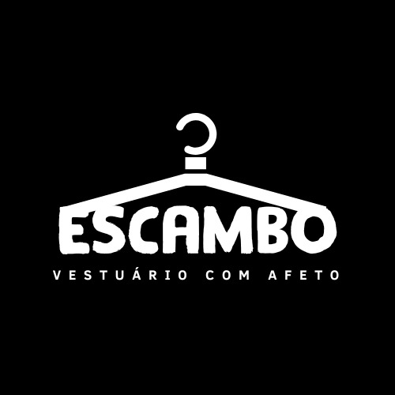

# Plataforma Escambo

Escambo é uma plataforma online que permite a troca de vestuário com afeto, como roupas, sapatos e acessórios, entre os usuários. As pessoas podem oferecer suas peças de vestuário em troca de outras que desejam adquirir, sem a necessidade de usar dinheiro como intermediário. Plataforma Escambo e práticas como essas, incentivam conexões humanas, fortalecem os laços sociais, incentivam a sustentabilidade e promovendo uma sensação de comunidade e pertencimento. É uma forma emocionalmente enriquecedora e socialmente consciente de renovar o guarda-roupa de forma econômica e sustentável.

# Equipe e Formas de Contato

1. Nome...
2. Nome...

>Descrever as formas de contato da equipe - WhatsApp, Discord, etc.

# Horário de Reuniões

>Descrever dias, horários e local das reuniões da equipe

# Tecnologias Utilizadas

>Enumerar as tecnoligas utilzadas no projeto

# Documentação

[Link para os documentos do projeto](doc/documentacao.md)

# Manual da Desenvolvedor

>Descrever os comandos iniciais para começar a colaborar com o desenvolvimento do projeto
